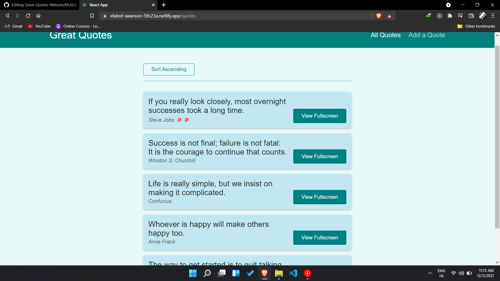

#About this repository

*This is a simple website made in react . If you want to run in your local machine follow the below steps and you will be good to go.*

*You  download or clone the repository though. If you do that, you have to `npm install` all dependencies and start the development server via `npm start`.*

Here is the live demo of the project 
https://elated-swanson-59c23a.netlify.app/

